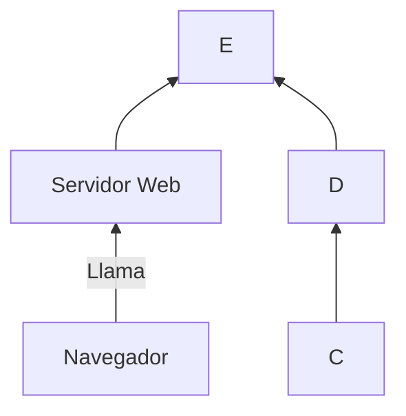
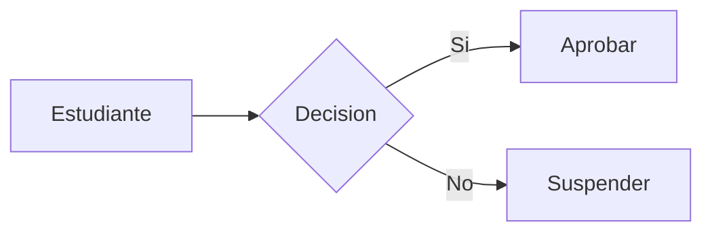

+++
title = 'Basico'
date = 2024-10-04T13:24:33+02:00
draft = false
weight = 10
+++

## Edición básica

### Titulos

Para establecer los titulos usaré la siguiente sintaxis

```makefile

# titulo1
## titulo2
### titulo3
#### titulo4
##### titulo5
###### titulo6
```

Y se verá

---
# titulo1
## titulo2
### titulo3
#### titulo4
##### titulo5
###### titulo6
---

### Negrita y formato

Para ver el texto en negrita escribo

```markdown
**Texto en negrita** texto normal
```

Y se verá

**Texto en negrita** texto normal


PHP es un lenguaje interesante y bonito accede a la web





## Recursos que puedes obtener

{}
